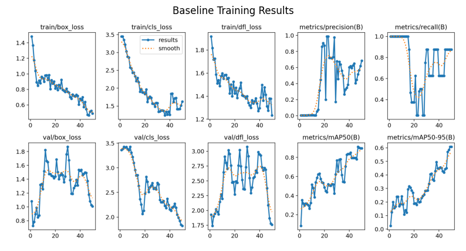
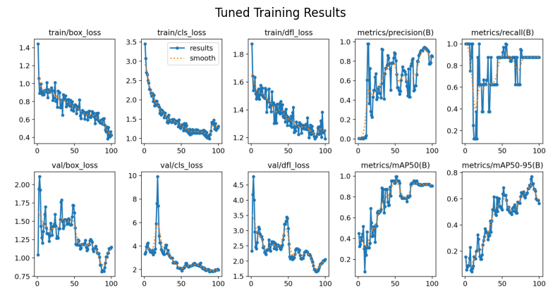

# Sharp Object Detection Using Deep Learning

Repository ini berisi implementasi deteksi objek tajam (sharp object detection) menggunakan pendekatan deep learning berbasis CNN dan object detection model.

## 📌 Overview
Penelitian ini berfokus pada deteksi objek tajam seperti pisau menggunakan model deep learning. Eksperimen dilakukan dengan membandingkan model **baseline** dan **model yang telah dituning** untuk meningkatkan performa deteksi.

## 🎯 Objectives
- Mendeteksi objek tajam pada citra
- Menganalisis performa model baseline
- Meningkatkan performa melalui hyperparameter tuning

## 🧠 Methodology
- Dataset:
  Jumlah gambar: 61
  Jumlah kelas: 4
  Kelas objek: Knife, Scissors, Cutter, Syringe
  Format: YOLO format (bounding box)
- Model: yolov8
- Training:
  - Baseline model
  - Tuned model (learning rate, epoch, dll)
- Evaluation metrics:
  - Precision
  - Recall
  - mAP50
  - mAP50–95

## 📊 Results

### Baseline Model

### Tuned Model

📌 Model hasil tuning menunjukkan peningkatan performa terutama pada nilai mAP dan stabilitas training.

## 🎥 Video Presentation
Penjelasan lengkap mengenai metode dan hasil eksperimen dapat dilihat pada video berikut:

👉 **[Link Video Presentasi](https://youtu.be/rZNLS1y1wmI)**

## 🚀 Streamlit
Hasil model obeject detection dapat dilihat pada link berikut:

👉 **[Link Streamlit](https://huggingface.co/spaces/lalakinan/yolo-sharp-object-detection)**

## 📂 Project Structure
- notebooks/ -> Google Colab notebooks
- assets/ -> Training result images & figures

